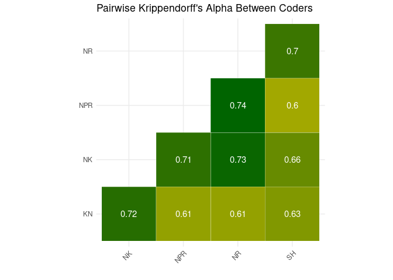

# IRR Report for stances by political actors

This report contains the intercoder reliability for coded stances from
political actors. The annotations are downloaded from the annotinder
backend by [download_stances.R](download_stances.R) and can be found in
the [data
folder](https://github.com/vanatteveldt/issuepositions/tree/main/data/intermediate)
folder.

# Overall Reliability

The overall reliability across is a Krippendorff’s alpha of **0.7**
(excluding test and no-agreement units)

## Topic Reliability

The following table reports the progression of issues coded and the
current reliability (calculated using Krippendorff’s alpha) for each
topic.

| Topic          | \# units | Avg. coders per unit | Agreement (%) | Reliability (α) |
|:---------------|:--------:|:--------------------:|:-------------:|:---------------:|
| Immigration    |   2163   |         2.10         |     0.93      |      0.73       |
| CivilRights    |   1819   |         2.05         |     0.89      |      0.66       |
| Environment    |   1650   |         2.69         |     0.90      |      0.69       |
| Government     |   1536   |         2.12         |     0.95      |      0.56       |
| Economic       |   1441   |         2.63         |     0.90      |      0.64       |
| Health         |   767    |         2.02         |     0.92      |      0.57       |
| Agriculture    |   688    |         2.02         |     0.90      |      0.72       |
| Defense        |   611    |         2.00         |     0.94      |      0.72       |
| Education      |   506    |         2.00         |     0.90      |      0.66       |
| Housing        |   328    |         2.00         |     0.91      |      0.66       |
| EU             |   298    |         1.98         |     0.93      |      0.78       |
| Infrastructure |   153    |         2.00         |     0.92      |      0.77       |

## Topic: Agriculture (n=688, α=0.72)

## Topic: CivilRights (n=1819, α=0.66)

## Topic: Defense (n=611, α=0.72)

## Topic: Economic (n=1441, α=0.64)

## Topic: Education (n=506, α=0.66)

## Topic: Environment (n=1650, α=0.69)

## Topic: EU (n=298, α=0.78)

## Topic: Government (n=1536, α=0.56)

## Topic: Health (n=767, α=0.57)

## Topic: Housing (n=328, α=0.66)

## Topic: Immigration (n=2163, α=0.73)

## Topic: Infrastructure (n=153, α=0.77)

