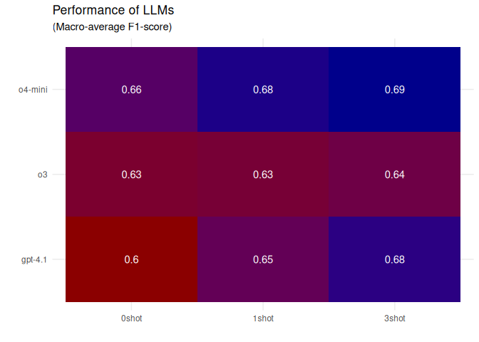
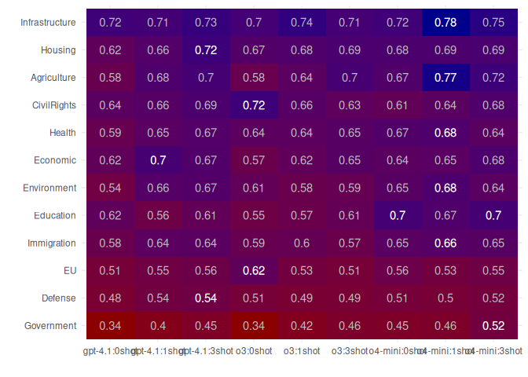
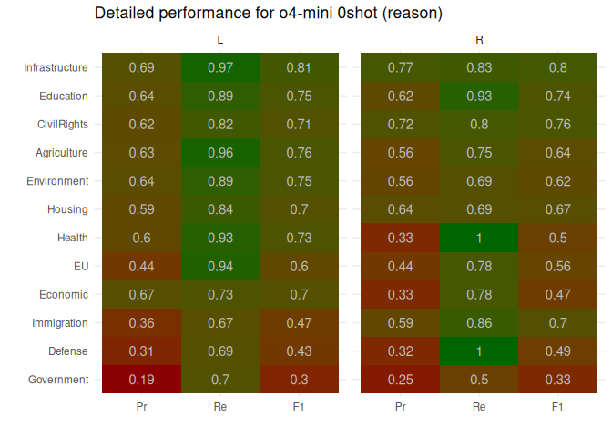
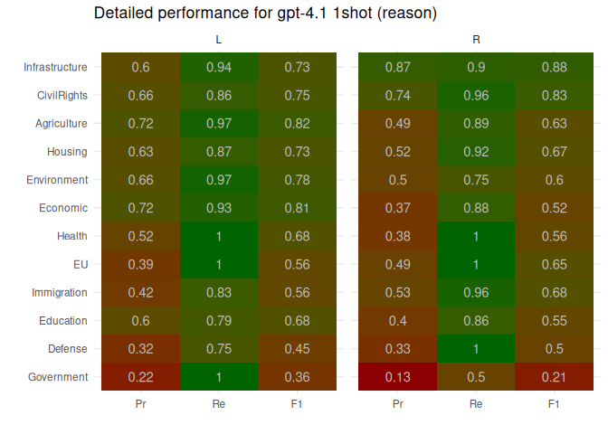
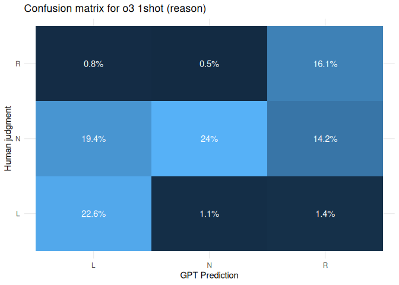
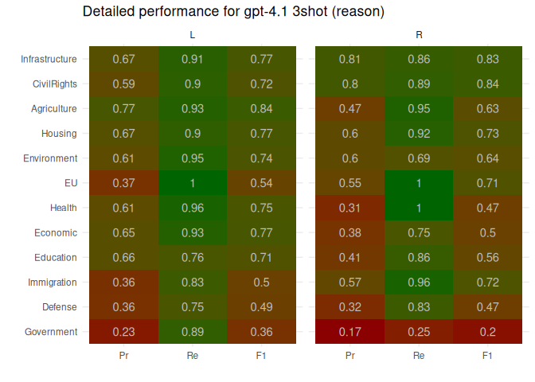
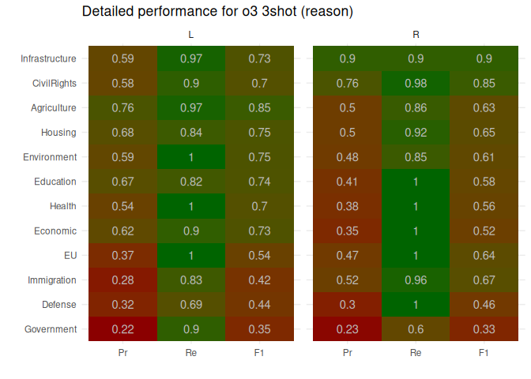
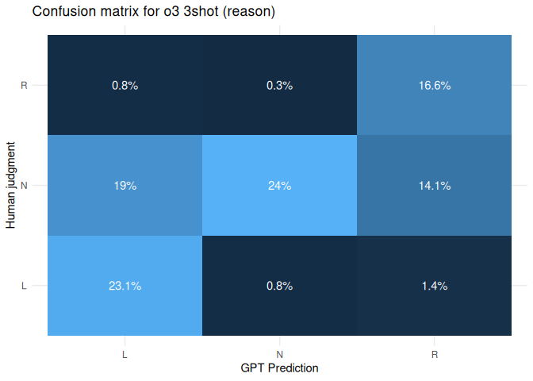
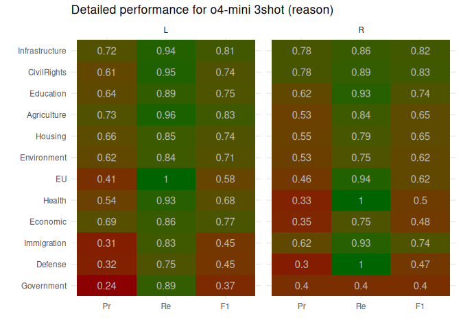

# Performance of automatic classification

We tested a variety of models in different x-shot settings and with ~~or
without~~ chain-of-reasoning prompts.

Specifically, the model was asked to judge the stance of actors in
121.1944444 sentences on 12 topics. The specific meaning of each stance
depends on the topic, but the options were always L (mostly
left/progressive stances), N (neutral) or R (more
right-wing/conservative). For more information, see the
[codebook](../../codebook/codebook.md) and [topic
list](../../codebook/topics-en.md)
([dutch](../../codebook/topics-nl.md)).

# Overall performance

The table below gives the overall (macro-averaged) performance of each
model:

| model   | shot  | reason |    n |   acc |     f |
|:--------|:------|:-------|-----:|------:|------:|
| gpt-4.1 | 0shot | reason | 1200 | 0.598 | 0.605 |
| gpt-4.1 | 1shot | reason | 1200 | 0.647 | 0.653 |
| gpt-4.1 | 3shot | reason | 1200 | 0.677 | 0.680 |
| o3      | 0shot | reason | 3489 | 0.623 | 0.629 |
| o3      | 1shot | reason | 1200 | 0.627 | 0.633 |
| o3      | 3shot | reason | 1200 | 0.637 | 0.643 |
| o4-mini | 0shot | reason | 1200 | 0.662 | 0.662 |
| o4-mini | 1shot | reason | 1200 | 0.683 | 0.682 |
| o4-mini | 3shot | reason | 1200 | 0.684 | 0.685 |

# Per topic performance

The table below shows the f-score for each model per topic
(macro-averaged over the stances including N), with the best model per
topic indicated in bold:

# Per class performance

Finally, the tables below give per-class precision/recall/f scores and
confusion matrices for each invidual model:

## Model gpt-4.1: 0shot (reason)

## Model o3: 0shot (reason)

## Model o4-mini: 0shot (reason)

## Model gpt-4.1: 1shot (reason)

## Model o3: 1shot (reason)

## Model o4-mini: 1shot (reason)

## Model gpt-4.1: 3shot (reason)

## Model o3: 3shot (reason)

## Model o4-mini: 3shot (reason)

