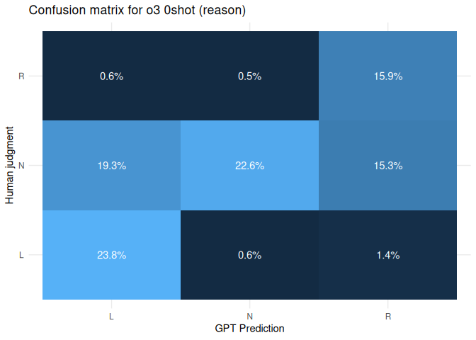
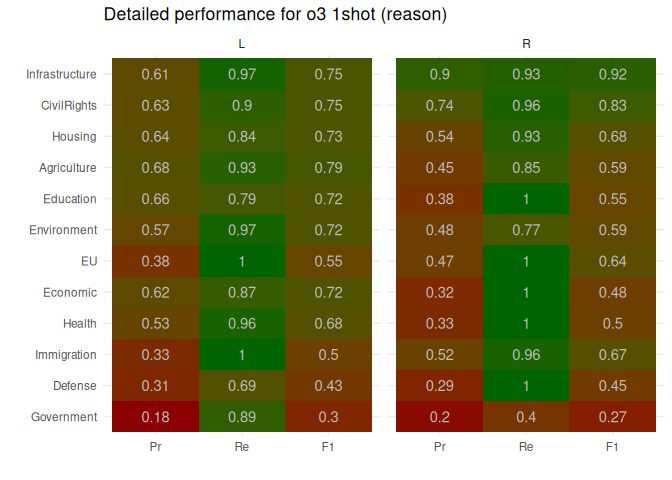
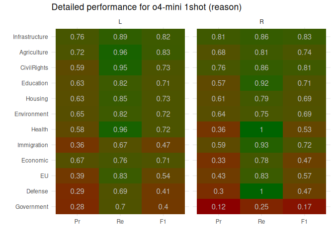

# classification

# Overall performance

| model   | shot  | reason |    n |   acc |     f |
|:--------|:------|:-------|-----:|------:|------:|
| gpt-4.1 | 0shot | reason | 1200 | 0.598 | 0.605 |
| gpt-4.1 | 1shot | reason | 1200 | 0.647 | 0.653 |
| gpt-4.1 | 3shot | reason | 1200 | 0.677 | 0.680 |
| o4-mini | 0shot | reason | 1200 | 0.662 | 0.662 |
| o4-mini | 1shot | reason | 1200 | 0.683 | 0.682 |
| o4-mini | 3shot | reason | 1200 | 0.684 | 0.685 |

# Per topic performance

# Per class performance

## Model gpt-4.1: 0shot (reason)

## Model o4-mini: 0shot (reason)

## Model gpt-4.1: 1shot (reason)

## Model o4-mini: 1shot (reason)

## Model gpt-4.1: 3shot (reason)

## Model o4-mini: 3shot (reason)

