Progression Report
================

This file is used to visually represent the current status of coding
data. Included are the reliability scores for coders and topics.

## Data

Raw data can be found in the [data
folder](https://github.com/vanatteveldt/issuepositions/tree/main/data)
folder and code used to generate statistics and plots is available in
[topic_status_report](https://github.com/vanatteveldt/issuepositions/blob/main/src/data-processing/topic_status_report.R)
file.

``` r
library(tidyverse)
library(irr)
library(ggplot2)
library(readr)
library(kableExtra)
library(simplermarkdown)
library(knitr)
library(dplyr)
library(purrr)
library(here)
```

``` r
gpt_units <- read_csv(here::here("data/intermediate/coded_units_gpt_nshot.csv"))|>
  select(-jobids)

stances <- read_csv(here::here("data/intermediate/stances.csv"))

all_units <- stances |>
  filter(jobtype=="normal") |>
  ungroup() |>
  list_units() |>
  arrange(unit_id) |>
  select(-jobids) |>
  left_join(gpt_units)

normal_units <- stances |>
  filter(jobtype=="normal") |>
  ungroup() |>
  list_units() |>
  arrange(unit_id) |>
  select(-jobids) |>
  left_join(gpt_units)

gpt_issues_all <- read_csv(here::here("data/intermediate/gpt_issues_all.csv")) |>
  filter(logprob >= -5)
```

## Coder Reliability

The overall reliability across is a Krippendorff’s alpha of **0.7**
(excluding test and no-agreement units)

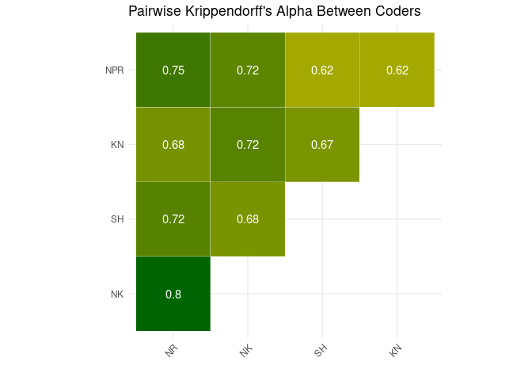

## Topic Reliability

The following table reports the progression of issues coded and the
current reliability (calculated using Krippendorff’s alpha) for each
topic.

<center>

<div class="cell-output-display">

|     Topic      | Completed | Total | Percentage Done | Reliability (α) |
|:--------------:|:---------:|:-----:|:---------------:|:---------------:|
|  Agriculture   |    790    |  688  |       87%       |      0.72       |
|  CivilRights   |   1819    | 1775  |       98%       |      0.66       |
|    Defense     |    682    |  611  |       90%       |      0.72       |
|       EU       |    387    |  298  |       77%       |      0.78       |
|    Economic    |   1588    | 1324  |       83%       |      0.68       |
|   Education    |    561    |  506  |       90%       |      0.66       |
|  Environment   |   1650    | 1650  |      100%       |      0.69       |
|   Government   |   1774    | 1536  |       87%       |      0.56       |
|     Health     |    849    |  767  |       90%       |      0.57       |
|    Housing     |    422    |  328  |       78%       |      0.66       |
|  Immigration   |   2163    | 2163  |      100%       |      0.73       |
| Infrastructure |    203    |  153  |       75%       |      0.77       |
|     Order      |    627    |   0   |       0%        |       NA        |

</div>

</center>

## Topic: Agriculture

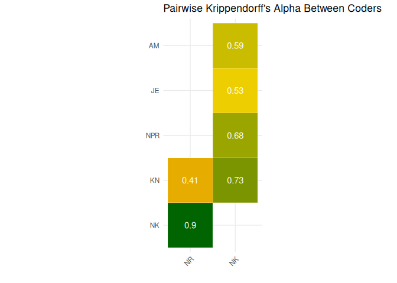

#### Topic α score: 0.7155914

## Topic: CivilRights

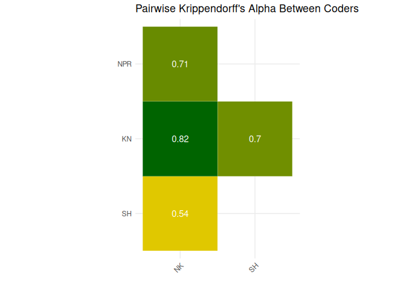

#### Topic α score: 0.6598389

## Topic: Defense

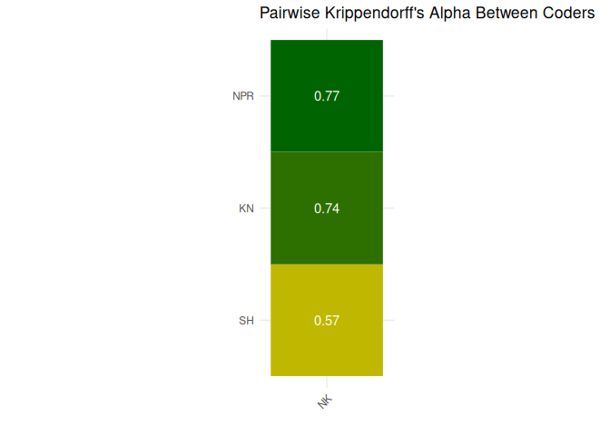

#### Topic α score: 0.7200128

## Topic: Economic

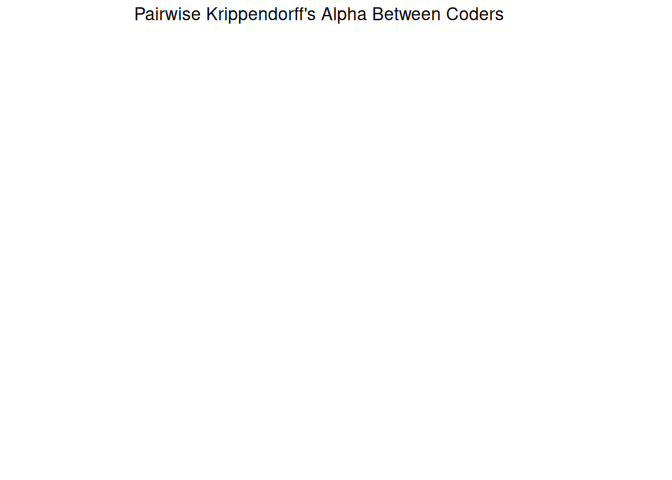

#### Topic α score: 0.6772036

## Topic: Education

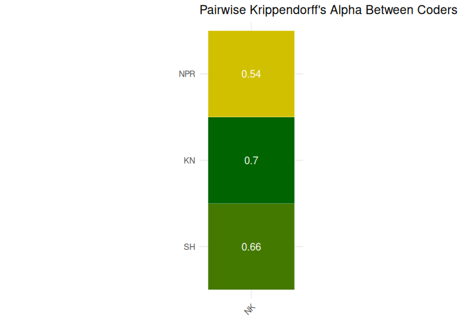

#### Topic α score: 0.6575879

## Topic: Environment

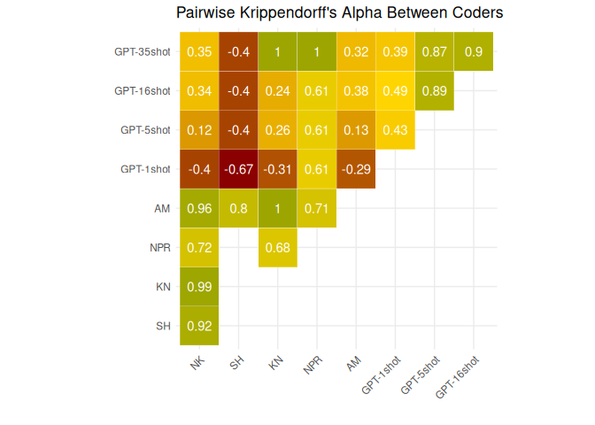

#### Topic α score: 0.6855924

## Topic: EU

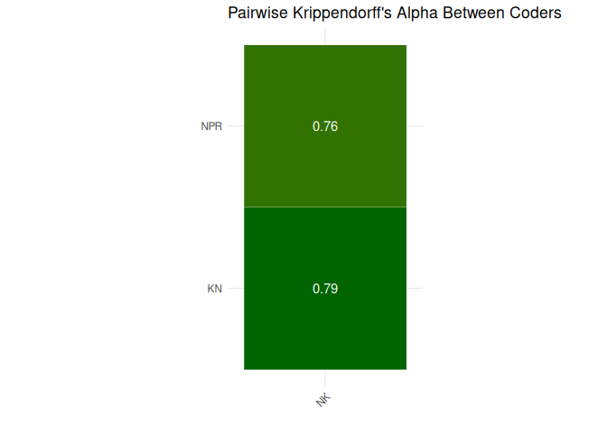

#### Topic α score: 0.7790702

## Topic: Government

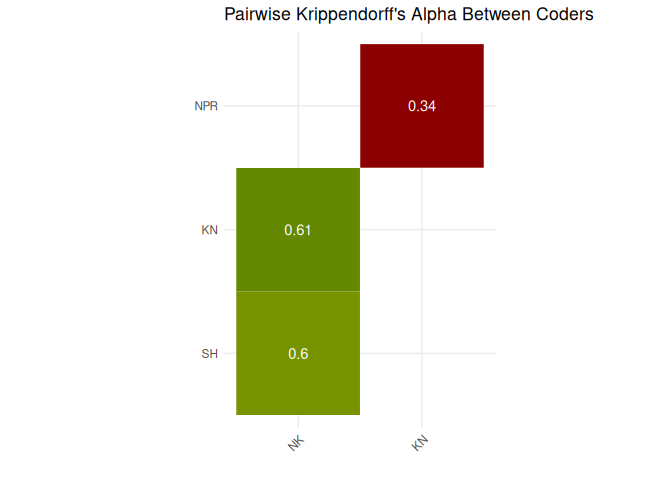

#### Topic α score: 0.5607463

## Topic: Health

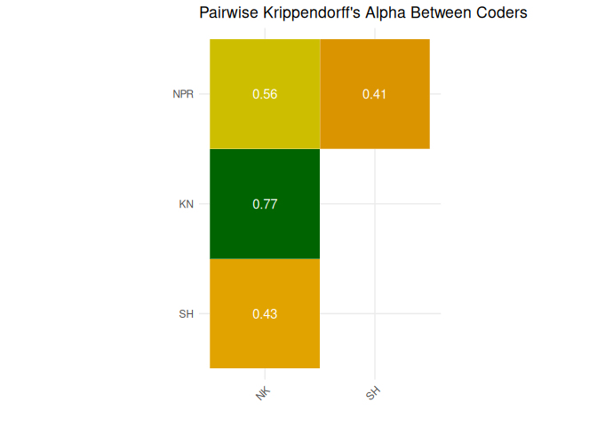

#### Topic α score: 0.571361

## Topic: Housing

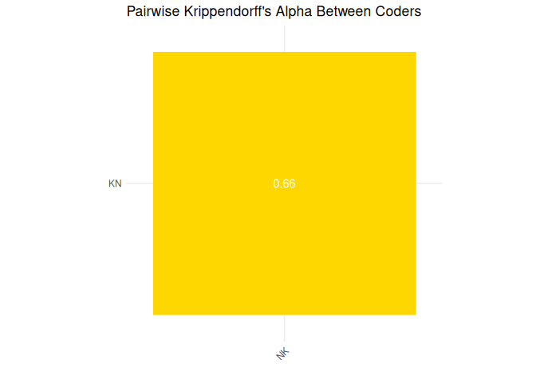

#### Topic α score: 0.6646158

## Topic: Immigration

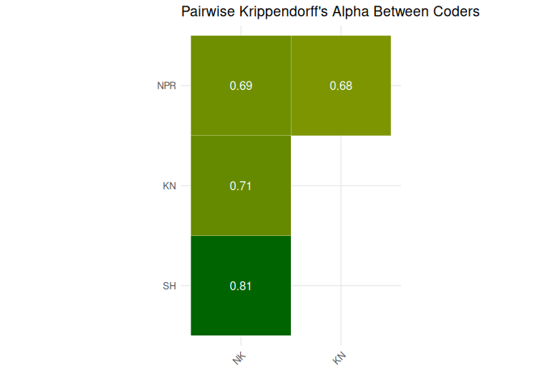

#### Topic α score: 0.7258703

## Topic: Infrastructure

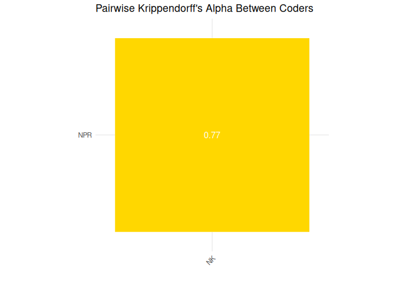

#### Topic α score: 0.7707441
