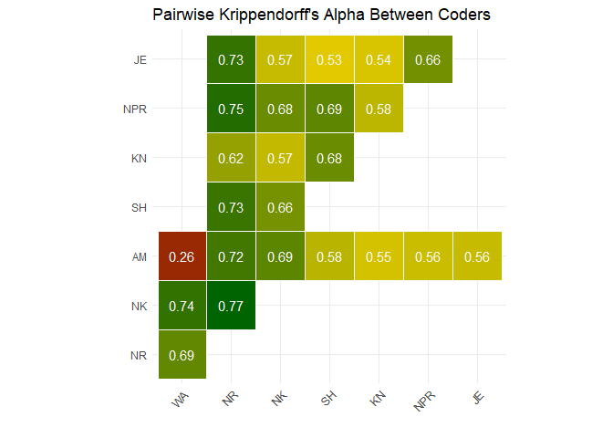
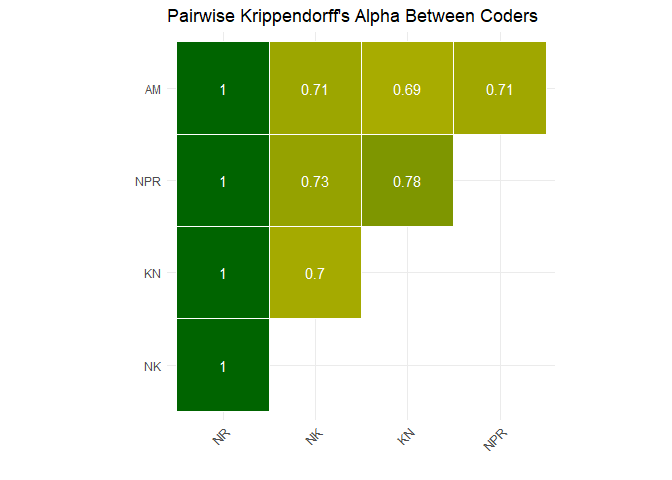
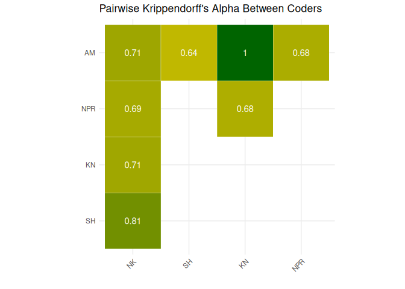
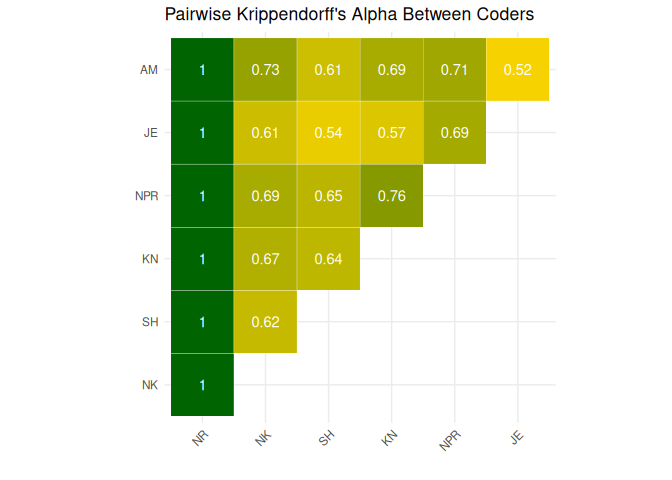
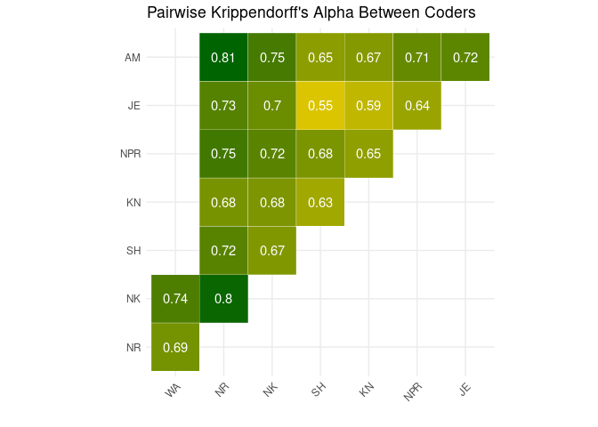
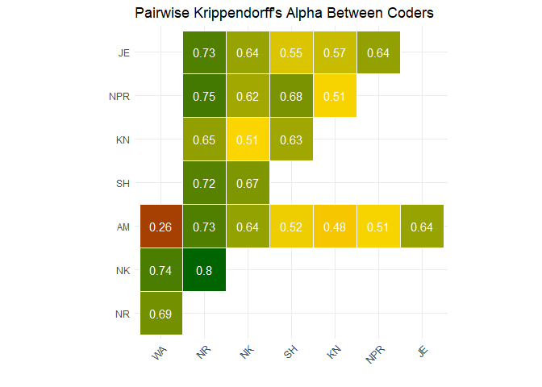
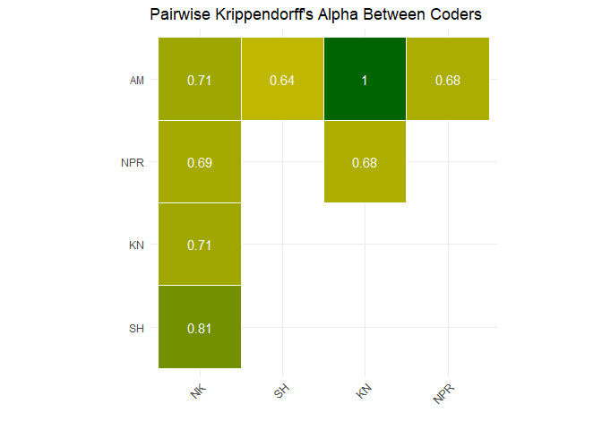

# Progression Report


This file is used to visually represent the current status of coding
data. Included are the reliability scores for coders and topics.

## Data

Raw data can be found in the [data
folder](https://github.com/vanatteveldt/issuepositions/tree/main/data)
folder and code used to generate statistics and plots is available in
[topic_status_report](https://github.com/vanatteveldt/issuepositions/blob/main/src/data-processing/topic_status_report.R)
file.

``` r
library(tidyverse)
library(irr)
library(ggplot2)
library(readr)
library(kableExtra)
library(simplermarkdown)
library(knitr)
library(dplyr)
library(purrr)
```

``` r
all_units <- read_csv(here::here("data/intermediate/coded_units.csv"))
gpt_issues_all <- read_csv(here::here("data/intermediate/gpt_issues_all.csv")) |>
  filter(logprob >= -5)
```

## Coder Reliability

The overall reliability across all coded units is a Krippendorff’s alpha
of **0.71**



## Topic Reliability

The following table reports the progression of issues coded and the
current reliability (calculated using Krippendorff’s alpha) for each
topic.

<center>

|     Topic      | Completed | Total | Percentage Done | Reliability (α) |
|:--------------:|:---------:|:-----:|:---------------:|:---------------:|
|  Agriculture   |    790    |  184  |       23%       |      0.72       |
|  CivilRights   |   1819    | 1819  |      100%       |      0.67       |
|    Defense     |    682    |   0   |       0%        |       NA        |
|       EU       |    387    |   0   |       0%        |       NA        |
|    Economic    |   1588    | 1472  |       93%       |      0.69       |
|   Education    |    561    |  50   |       9%        |      0.26       |
|  Environment   |   1650    | 1650  |      100%       |      0.69       |
|   Government   |   1774    |   0   |       0%        |       NA        |
|     Health     |    849    |   0   |       0%        |       NA        |
|    Housing     |    422    |   0   |       0%        |       NA        |
|  Immigration   |   2163    | 2163  |      100%       |      0.71       |
| Infrastructure |    203    |   0   |       0%        |       NA        |
|     Order      |    627    |   0   |       0%        |       NA        |

</center>

## Topic: Economic



#### Topic α score: 0.6870683

## Topic: Immigration



#### Topic α score: 0.7103194

## Topic: CivilRights



#### Topic α score: 0.6694982

## Topic: Environment



#### Topic α score: 0.6928992

## Topic: Agriculture



#### Topic α score: 0.7194397

## Topic: Education



#### Topic α score: 0.2608696
